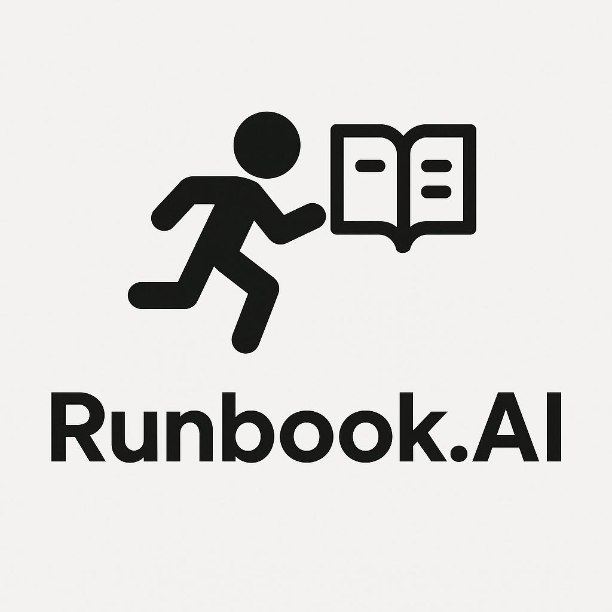

<p align="center">
  
</p>

# Runbook MCP Server

Runbook MCP Server enables you to run your own runbooks from Claude Desktop.

- Run ops runbooks (e.g., deploy a service, upgrade a Kubernetes cluster)
- Run manual test plans (e.g., create a new EC2 instance, ssh into the instance, and run the integration test there).

Please watch the demo video below to understand how it works!


# How to Use

To create a new runbook, use the `create_runbook` tool. Here is an example prompt:

```
Create a new runbook:

- name: list_pods
- content: List pods in all namespaces, find pods that are not ready, and send that to Slack.

You don't need to interpret the content. Please just pass it to the tool.
```

To run a runbook, take the following steps:

1. Click "Attach from MCP" from Claude Desktop.
2. Select `get_runbook_as_prompt` from the list of integrations.
3. Pass the name of the runbook you would like to execute.
4. Submit the generated prompt.

Then Claude Desktop will talk to other MCP servers to run the runbook.


# Claude Desktop Configuration

Put the following configuration to `claude_desktop_config.json`.

```json
{
  "mcpServers": {
    "runbook": {
      "command": "uv",
      "args": [
        "--directory",
        "<ABSOLUTE_PATH>/runbook-mpc-server",
        "run",
        "runbook.py"
      ]
    }
  }
}

```

# Upcoming Features

- Rest endpoint + frontend for managing runbooks.
- Be able to edit the runbook (with versioning)
- run runbook template X that is instantiated with given inputs
- show an execution plan for runbook X (dry-run)
- convert a previous conversation into a runbook
- fine-tuning.
- Be able to refine a runbook. If there is a successful execution, save it as an example
  and give it to Claude.
- Periodic execution
